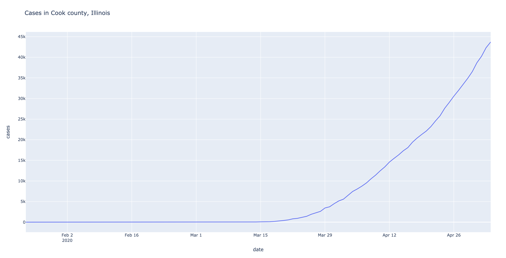

# covid-grapher
Graph Covid-19 Trends by U.S. Counties


```
>  python generate.py --help
Usage: generate.py [OPTIONS]

Options:
  --state TEXT   State in the US  [required]
  --county TEXT  County in the US  [required]
  --graph TEXT   cases | deaths
  --help         Show this message and exit.
```

Example:

```
> python generate.py --state illinois --county cook
```


